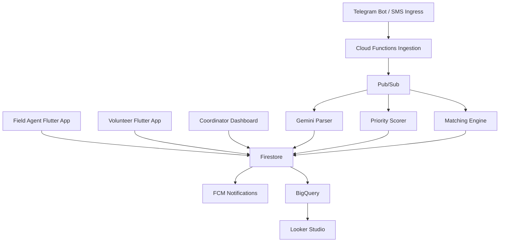

# Guardians of the Globe Architecture

## North star

Build a low-connectivity response platform where any incoming need can be captured, structured, prioritized, matched, tracked, and reported without losing data when the network drops.

## Core principles

1. Offline capture first.
2. Serverless backend by default.
3. Real-time coordination through Firestore listeners.
4. Human override everywhere.
5. Organization-scoped access and auditability.

## Recommended stack

### Mobile

- Flutter
- Firebase Auth
- Cloud Firestore
- Firebase Storage
- Firebase Cloud Messaging
- Google Maps SDK
- ML Kit OCR
- Hive for local drafts and upload outbox metadata

### Backend

- Cloud Functions for Firebase (2nd gen)
- Cloud Pub/Sub
- Vertex AI Gemini 2.0 Flash
- Cloud Speech-to-Text
- Firestore
- Firebase Storage
- Cloud Scheduler

### Web

- React
- Vite
- Firebase Hosting on Spark when connected
- Firestore SDK
- OpenStreetMap + Leaflet for the free-only build

### Analytics

- Firebase extension: Stream Firestore to BigQuery
- BigQuery
- Looker Studio

## Free-only MVP profile

The first deployable build should avoid any service that forces Blaze or Google Cloud billing.

Use:

- React + Vite
- local storage for immediate working state
- Firebase Spark later for Auth, Firestore, and Hosting
- OpenStreetMap + Leaflet

Do not depend on for MVP deployment:

- Cloud Functions
- Pub/Sub
- Vertex AI
- BigQuery
- Firebase Extensions
- phone auth
- Google Maps Platform

### Messaging fallback

- Telegram Bot API
- Cloud Functions webhook endpoint
- Third-party SMS provider through Cloud Functions for feature phones

## High-level architecture

## Layer 1: Ingestion

### Field agent app

Primary capture surface for smartphone users.

Recommended flow:

1. Agent opens a 3-step need form.
2. App stores draft and outbox item locally.
3. If online, app writes to Firestore immediately.
4. If offline, outbox item remains in Hive and retries on reconnect.
5. Attachments upload after the parent need document exists.

Important correction:

- Firestore already supports offline persistence on Android and iOS. Use that for normal synced records.
- Keep Hive for an explicit outbox queue, partially completed drafts, attachment upload retries, and local crash recovery.

### Telegram bot

Good fallback for users who already have Telegram, but this belongs after the free-only MVP because it needs a backend endpoint to receive updates reliably.

Recommended use:

- Receive text, photos, location pins, and voice notes.
- Normalize all incoming messages into an `ingestion_events` collection.
- Parse them asynchronously into candidate needs.
- Let coordinators review low-confidence parses before publishing.

### SMS fallback

This is still worth keeping, but it is not part of the free-only MVP.

- Do not rely on a generic "Google Cloud Communication Services" layer for SMS intake.
- Instead, use a dedicated SMS provider and forward webhooks into Cloud Functions.
- Treat SMS as text-only, low-bandwidth intake with manual follow-up for ambiguity.

## Layer 2: Intelligence

### Parser

Use Gemini to convert free text or transcripts into structured need data:

- `need_type`
- `urgency_input`
- `language`
- `location_hint`
- `people_affected`
- `description`
- `confidence`

Recommended pattern:

1. Write raw event.
2. Publish parse job to Pub/Sub.
3. Run transcript step first for audio.
4. Run Gemini with schema-constrained JSON output.
5. Store both raw and normalized artifacts.
6. Escalate low-confidence results to coordinator review.

### Priority scorer

Your current formula is workable, but it needs a few more signals to avoid bad rankings.

Recommended production formula:

`priority_score = urgency_input*0.35 + unmet_hours*0.20 + recency_decay*0.15 + vulnerable_population*0.15 + verification_boost*0.10 + escalation_flag*0.05`

Why:

- Pure urgency is not enough.
- Vulnerable groups and verified needs should rise faster.
- A coordinator needs a manual escalation switch.

### Matching engine

Your ranking logic is solid. Add these constraints:

- Filter by organization and service area first.
- Hard-filter by required skill and language if mandatory.
- Hard-filter by active status and current task load.
- Use geohash bounds + exact distance check for nearby volunteers.
- Return top 3 candidates plus a rationale payload for the dashboard.

Recommended score:

`match_score = skill_fit*0.40 + proximity*0.30 + availability*0.15 + language_fit*0.10 + acceptance_history*0.05`

## Layer 3: Core platform

### Firestore

Main collections:

- `organizations`
- `users`
- `field_agents`
- `volunteers`
- `needs`
- `tasks`
- `events`
- `ingestion_events`
- `reports`

Design rules:

- Every operational document carries `organization_id`.
- Every mutable workflow document carries `status`, `created_at`, `updated_at`, and `version`.
- Every write that changes workflow state emits an audit event.

### Cloud Functions

Use 2nd gen functions and separate them by responsibility:

- Firestore triggers for lifecycle reactions
- HTTP functions for bot and webhook intake
- Scheduled functions for scoring, retries, and exports
- Pub/Sub functions for async processing

Suggested functions:

- `onNeedCreated`
- `parseIngestionEvent`
- `runPriorityScorer`
- `runMatchingEngine`
- `assignTask`
- `sendVolunteerNotification`
- `retryFailedUploads`
- `syncAnalytics`

### Firebase Auth

Use custom claims for:

- `admin`
- `coordinator`
- `field_agent`
- `volunteer`

Recommendation:

- Keep a `users` document as the profile source of truth.
- Keep claims minimal and access-related only.
- Do not store profile data in claims.

### Pub/Sub

Keep it as the event bus between ingestion and downstream workers.

Suggested topics:

- `need.created`
- `ingestion.received`
- `parse.requested`
- `task.assignment.requested`
- `volunteer.notify`
- `analytics.refresh.requested`

## Layer 4: Interfaces

### Coordinator dashboard

Primary command center.

Must-have views:

- Live needs board
- Map with clustered need and volunteer markers
- Assignment panel with top candidate explanations
- Queue for low-confidence AI parses
- Event timeline per need
- Organization-level filters

### Volunteer app

Primary dispatch surface.

Must-have flow:

1. FCM notification arrives.
2. Volunteer opens task.
3. Accept or decline.
4. Location and ETA sync back to Firestore.
5. Completion evidence uploads to Storage.

### Field agent app

Primary data capture surface.

Must-have features:

- Offline drafts
- GPS autofill with manual correction
- Photo attachment
- OCR assist for documents or written notes
- Sync state visibility
- Retry queue screen

## Missing links and fixes

### 1. Duplicate need detection

Without this, Telegram, field agents, and coordinators can create parallel records for the same incident.

Add:

- Nearby-open-need similarity check
- Phone-number and text similarity heuristics
- Manual merge action in dashboard

### 2. Confidence and human review

AI should not directly create fully trusted needs in all cases.

Add:

- `parse_confidence`
- `review_required`
- `reviewed_by`
- `reviewed_at`

### 3. Multi-tenant access control

Without strict organization scoping, one NGO can accidentally see another NGO's cases.

Add:

- `organization_id` on every document
- Firestore rules that enforce org membership and role

### 4. Attachment workflow

Images and voice notes need a proper lifecycle.

Add:

- `pending_upload`
- `uploaded`
- `virus_scan_pending` if you later introduce scanning
- `transcribed`
- `failed`

### 5. Conflict resolution

When multiple users edit the same need, you need deterministic behavior.

Recommendation:

- Last write wins for non-critical notes
- Transactional updates for assignment and status changes
- Append-only audit events for sensitive actions

### 6. Abuse prevention

Open messaging channels can be spammed.

Add:

- Rate limits on webhook sources
- Blocklist support
- App Check for first-party apps
- Manual suspend action in dashboard

### 7. Observability

You need operational visibility from day one.

Add:

- Structured logs with correlation IDs
- Dead-letter handling for failed parse jobs
- Error alerts on critical functions

### 8. Data retention and consent

This matters because you are handling location, phone numbers, and likely sensitive needs.

Decide:

- How long raw voice notes are stored
- Whether minors or health-related cases require masking
- What fields should be redacted in exports

## Final recommendation

Start with the web field intake, dashboard, local workflow, and Spark-ready data model first. Add Firebase integration next. Add Telegram only after the human workflow is already clean. SMS should be the last ingress channel, because it increases ambiguity, compliance work, and support load.
